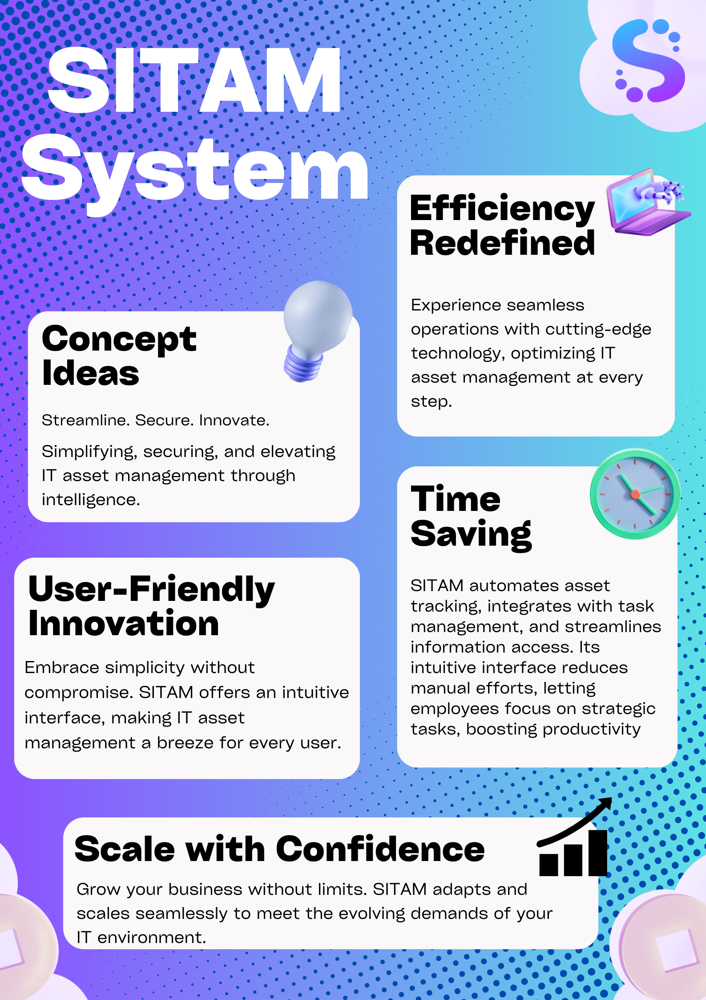
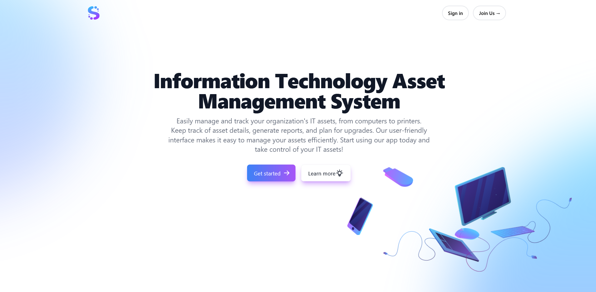
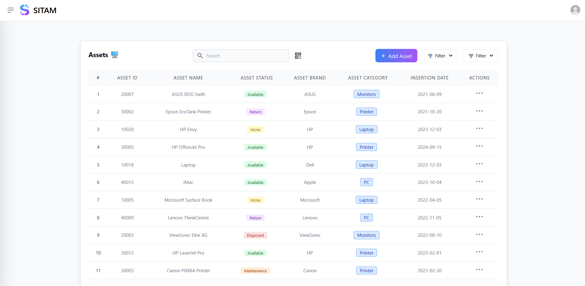

## Senior Project


## Overview:

Welcome to the IT Assets Management System, an advanced solution designed for efficient management and tracking of IT assets within your organization.
This system provides a centralized platform to monitor and control various IT resources, enhancing productivity and ensuring optimal asset utilization.

## Features:

- **Asset Tracking:** Maintain a detailed record of all IT assets, including hardware and peripherals.

- **Asset History:** Keep a comprehensive history log for each IT asset and peripheral.

- **Virtual Assistant:** Integrate a chat bot powered by OpenAI for enhanced user interaction.

- **Dashboard:** Utilize a powerful dashboard powered by PowerBI.

- **Maintenance:** Categorize maintenance tasks based on urgency.

- **Barcode Tracking:** Easily track your assets using barcode technology.

- **User-Friendly Interface:** Experience a sleek design powered by React.js and styled with Tailwind CSS for intuitive navigation and quick access to essential information.

- **Status Monitoring:** Keep tabs on the status and lifecycle of each asset, from procurement to retirement.

- **Real-time Updates with Firebase:** Leverage Firebase Cloud Firestore for seamless real-time updates, ensuring you and your team always have the latest information.

- **Authentication and Authorization:** Ensure secure access with Firebase Authentication using JSON Web Tokens (JWT), allowing you to define roles and permissions for precise control over access levels.

- **Print Reports:** Generate reports with real-time data from Firebase Cloud Firestore, ensuring you and your team always have the latest information.




## Technologies Used:

- **Frontend:** React.js, Tailwind CSS

- **Backend:** Firebase (Cloud Firestore, Authentication)


## User Interface:





## Installation

1. **Clone the repository:**

   ```bash
   git clone https://github.com/Danalmestadi/Seinor-Project.git
